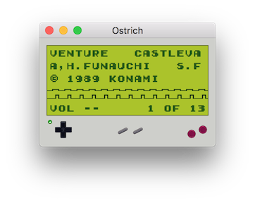

# Ostrich #

Ostrich is a macOS media player app for playback of Game Boy Sound System files. Under the covers, it is a Nintendo Game Boy emulator written in Swift.

This readme captures how to build and use Ostrich. For more technical details, check out [my blog post on it here](http://rmconway.com/ostrich/).

## Status ##

Ostrich emulates both of the Game Boy's pulse wave channels and can play them back for about half of the Game Boy's commercial titles. The other half require emulation of cartridge memory banking, or some of the more obscure LR35902 instructions, which are currently unsupported. The 4-bit wave and noise channels are also currently unsupported.

Popular working titles including Tetris, Castlevania, Double Dragon, and Batman.

## Building ##

Ostrich is built using Xcode. It uses [AudioKit](http://audiokit.io/), an open-source audio framework.
Ostrich is most recently tested using Xcode 8.2.1 (Swift 3.0.2), AudioKit 3.5, and macOS 10.12.3.
Ostrich requires macOS 10.11 (El Capitan) or newer.

To build Ostrich:

1. Clone this repository
1. [Download an AudioKit macOS release](https://github.com/audiokit/AudioKit/releases); note the most recently tested version above
1. Open the Ostrich workspace, ostrich.xcworkspace, with Xcode
1. Install the AudioKit framework to both the gameboy and gbsplayer Xcode projects as described in [the AudioKit installation guide](https://github.com/audiokit/AudioKit/blob/master/Frameworks/INSTALL.md)
1. Build the gameboy project
1. Build the gbsplayer project
1. Run the gbsplayer project

## Usage ##

Open Ostrich and load a GBS file (typically with extension .gbs) using File -> Open.

Playback controls are at the bottom portion of the interface. From left to right:

* The directional pad controls track selection and volume control:
    * Left: previous track
    * Right: next track
    * Up: volume up
    * Down: volume down
* The select and start buttons toggle muting of pulse channels 1 and 2, respectively
* The B and A buttons are stop and play/pause, respectively

The rest of the interface is dedicated to playback state. From top to bottom:

* The topmost text rows are the game name, composers, and copyright owner
* The upper and lower waveforms represent pulse channels 1 and 2, respectively
* The light near the bottom left represents playback state: red is stopped, yellow is paused, green is playing

Note that Ostrich may be resized for your viewing pleasure.

## Technical Details ##

For technical details on Ostrich, check out [my blog post on it here](http://rmconway.com/ostrich/).

## Author ##

Ostrich is written entirely by myself, [Ryan Conway](http://www.rmconway.com/). It would not have been possible without the help of [Austin Zheng](http://austinzheng.com/) and the documentation of Game Boy hardware written by many and available online. Some of this documentation is captured in [resources.txt](resources.txt).

I set out to create Ostrich with the goals of teaching myself Swift and furthering my knowledge of hardware emulation, system design, and retro game music. To those ends I believe Ostrich has been a success.

## License ##

Ostrich is copyright 2016-2017 Ryan Conway. Its source code is released under the MIT license; see [LICENSE.txt](LICENSE.txt).

Ostrich uses works that others have produced and made available under the terms of different licenses:
* Game Boy input images adapted from photograph by William Warby (https://www.flickr.com/photos/wwarby/), licensed under a Creative Commons Attribution Generic license (https://creativecommons.org/licenses/by/2.0/).

* The FontStruction “GameBoy Super Mario Land” (http://fontstruct.com/fontstructions/show/727186) by “nsun” is licensed under a Creative Commons Attribution Non-commercial license (http://creativecommons.org/licenses/by-nc/3.0/).